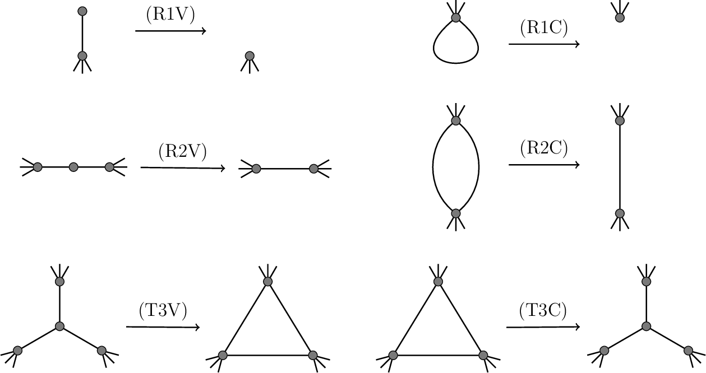
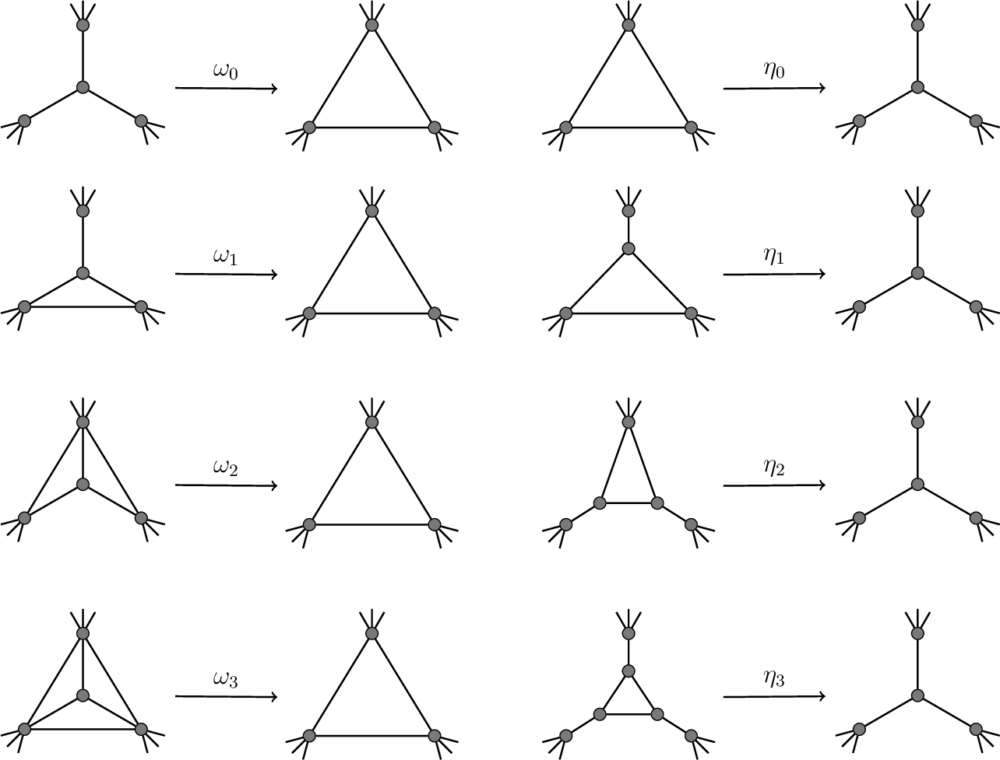

# Wye-Delta-Wye Graph Reduction


This library provides experimental implementations of algorithms for
reducing connected plane graphs to K1 (or 3-connected plane graphs to
K4) using a sequence of series/parallel reductions and wye-delta-wye
transformations. The six basic transformations are illustrated below.



For the reduction of 3-connected plane graphs to K4, the elementary
transformations by Steinitz are used directly:




The following algorithms are implemented:

- `feoprovan`: for connected plane graphs,
  based on [Feo and Provan (1993)](http://dx.doi.org/10.1287/opre.41.3.572)

- `steinitz`: for 3-connected plane graphs,
  based on [Steinitz (1922)](http://gdz.sub.uni-goettingen.de/dms/load/img/?PPN=PPN360609767&DMDID=dmdlog203)
  and [Grünbaum (1967)](http://dx.doi.org/10.1007/978-1-4613-0019-9)

- `temperature`: for 3-connected plane graphs,
  an experimental randomized algorithm


## Directory overview

- `bin`: Java byte code (generated)
- `data`: example plane graph data files (in adjacency list format)
- `doc`: API documentation (generated)
- `scripts`: Python and Sage scripts for generating plane graphs
- `src`: Java source code
- `test`: JUnit test cases


## Usage instructions

Building the library and running the application requires **Java SE 8**.

The application provides a simple GUI for loading plane graphs from
files and running algorithms on them. The GUI is launched if the
program is run without any command-line arguments.

In addition, there is a more powerful command-line interface. Run the
application with the argument `help` for CLI usage instructions.

```
$ java -jar bin/deltawye.jar help
Usage:

  $ java -jar deltawye.jar <algorithm> <filename>
  $ java -jar deltawye.jar batch <count> <algorithm> <filename>

where:

  <algorithm>   = steinitz <sg-strategy>
                | feoprovan <fp-start> <fp-strategy>
                | temperature <tr-strategy>
  <sg-strategy> = random | min | max | pole | nonpole
  <fp-start>    = random | min | max
  <fp-strategy> = random | minlabel | maxlabel | mindegree | maxdegree
  <tr-strategy> = random | short | long
  <count>       = <number of requested runs of the algorithm as integer>
  <filename>    = <path to graph data textfile in adjacency list format>

Example:

  $ java -jar deltawye.jar steinitz random data/icosahedron.txt
```

The command-line interface supports a batch mode that can be used to
run a reduction algorithm a specified number of times on a given
graph. A summary of the detected transformation sequences is written
to standard output. For example:

```
$ java -jar bin/deltawye.jar batch 100 temperature random data/random/random-30.txt
Randomized Wye-Delta-Wye algorithm,
running on graph with 30 vertices and 77 edges.
Selection Strategy: RANDOM.
Batch run: 100 iterations.
Run 1 completed after 53 steps with 34 Delta-Wye and 19 Wye-Delta transformations.
Run 2 completed after 56 steps with 37 Delta-Wye and 19 Wye-Delta transformations.
Run 3 completed after 55 steps with 34 Delta-Wye and 21 Wye-Delta transformations.
Run 4 completed after 51 steps with 30 Delta-Wye and 21 Wye-Delta transformations.
...
Run 99 completed after 53 steps with 32 Delta-Wye and 21 Wye-Delta transformations.
Run 100 completed after 52 steps with 30 Delta-Wye and 22 Wye-Delta transformations.

RESULTS:
  Shortest sequence: 41
  Longest sequence: 57
  Average length: 50.73

NORMALIZED RESULTS:
  Shortest sequence: 42
  Longest sequence: 58
  Average length: 51.73
```


### Build option 1: Use Makefile

Show usage instructions:

    $ make help

Build API documentation:

    $ make doc

Generate executable JAR file:

    $ make jar

Run the executable JAR file (GUI version):

    $ make run


### Build option 2: Run from JAR file

Step 1: Create an executable JAR file for the project

    $ mkdir -p bin
    $ javac -d bin -cp src src/deltawye/app/Main.java
	$ jar cfe bin/deltawye.jar deltawye.app.Main -C bin deltawye

This should create the executable JAR file `bin/deltawye.jar`.


Step 2: Run the generated JAR file

    $ java -jar bin/deltawye.jar

This should open the graphical interface of the application.


### Build option 3: Run from bytecode

Step 1: Build Java bytecode from the project sources

    $ mkdir -p bin
    $ javac -d bin -cp src src/deltawye/app/Main.java


Step 2: Run the Java bytecode of the project (GUI version)

    $ java -cp bin deltawye.app.Main


## License

Copyright 2016 Mathias Schenner

This software is distributed under the MIT License.
